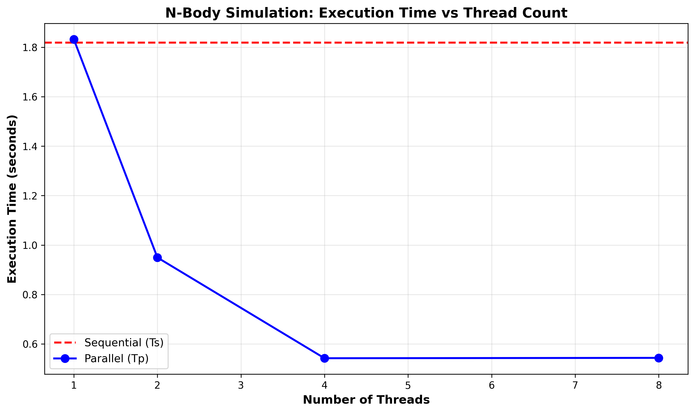
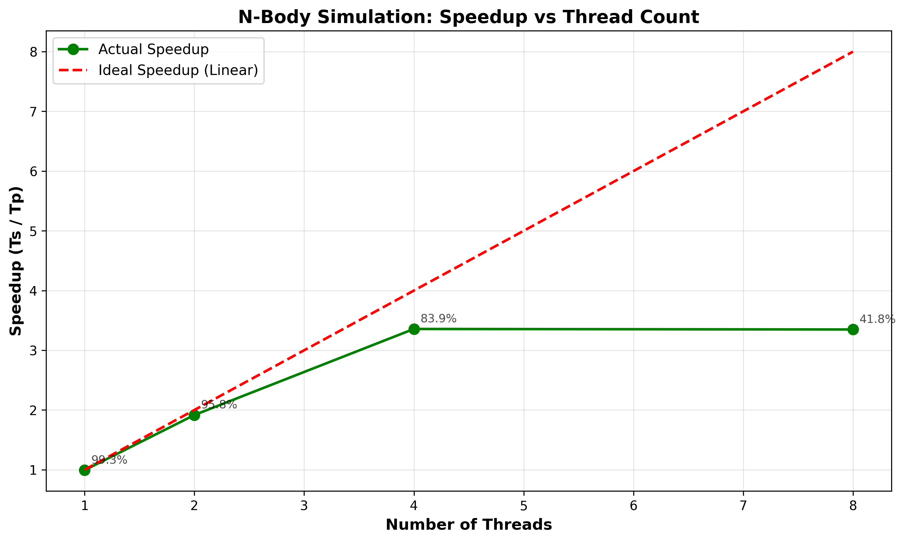

# N-Body Gravitational Simulation: Parallel Programming Project Report

**Author:** Ahmed Elsheikh , Karim Hossam , Miral Farghaly , Shahd Ayman , Mariam Foaad 
**Date:** November 28, 2025  
**Course:** Distrubuted Systems  

---

## 1. Introduction

### Problem Description

This project implements an N-body gravitational simulation, which simulates the gravitational interactions between N celestial bodies (particles or stars) in three-dimensional space. Each body exerts a gravitational force on every other body according to Newton's law of universal gravitation:

```
F = G × m₁ × m₂ / r²
```

where G is the gravitational constant, m₁ and m₂ are the masses of two bodies, and r is the distance between them.

### Why This Problem is Computationally Intensive

The N-body problem is computationally intensive for several key reasons:

1. **O(N²) Complexity**: For each time step, we must compute the gravitational force between every pair of bodies. This requires N × (N-1) force calculations per time step. For example:
   - N = 1,000 bodies → ~1 million force calculations per step
   - N = 2,000 bodies → ~4 million force calculations per step
   - N = 5,000 bodies → ~25 million force calculations per step

2. **Repeated Calculations**: The simulation runs for many time steps (typically 100-200+), and at each step, all O(N²) force calculations must be repeated.

3. **Floating-Point Operations**: Each force calculation involves:
   - Computing distance vectors (3 subtractions)
   - Distance magnitude (square root of sum of squares)
   - Force magnitude (division and multiplication)
   - Force components (3 multiplications and divisions)
   - This amounts to approximately 15-20 floating-point operations per pair

4. **Total Computational Load**: For N=2000 bodies with 100 time steps:
   - Total force calculations: 2000 × 1999 × 100 = ~400 million calculations
   - Total floating-point operations: ~6-8 billion operations

This makes the N-body problem an ideal candidate for parallelization and demonstrates the benefits of parallel computing in scientific simulations.

---

## 2. Sequential Implementation

### Languages and Libraries Used

- **Language**: C++17
- **Standard Libraries**:
  - `<vector>` - Dynamic arrays for storing bodies and forces
  - `<array>` - Fixed-size arrays for 3D force vectors
  - `<random>` - Mersenne Twister random number generator for initialization
  - `<chrono>` - High-resolution timing measurements
  - `<cmath>` - Mathematical functions (sqrt, etc.)
  - `<iostream>`, `<iomanip>` - Input/output formatting
  - `<fstream>` - File output for results

### Algorithm Description

The sequential algorithm follows a classical explicit time-stepping approach:

#### Data Structures
```cpp
struct Body {
    double x, y, z;       // Position in 3D space
    double vx, vy, vz;    // Velocity components
    double mass;          // Mass of the body
};
```

#### Algorithm Steps

**1. Initialization**
- Generate N bodies with random positions in a cube [-1, 1]³
- Assign random small velocities to create interesting dynamics
- Assign random masses in range [0.5, 2.0]
- Use fixed random seed for reproducibility

**2. Force Computation (O(N²) Algorithm)**
```
For each body i (from 0 to N-1):
    Initialize force Fi = (0, 0, 0)
    For each other body j (from 0 to N-1, j ≠ i):
        Calculate distance vector: d = position[j] - position[i]
        Calculate distance: r = ||d|| = sqrt(dx² + dy² + dz²)
        Add softening to avoid singularities: r² = r² + ε²
        Calculate force magnitude: F_mag = G × m[i] × m[j] / r²
        Calculate force direction: F_dir = d / r (unit vector)
        Accumulate force: Fi += F_mag × F_dir
    Store total force on body i
```

**3. Time Integration (Explicit Euler Method)**
```
For each body i:
    Calculate acceleration: a[i] = F[i] / m[i]
    Update velocity: v[i] = v[i] + a[i] × dt
    Update position: x[i] = x[i] + v[i] × dt
```

**4. Main Simulation Loop**
```
For each time step (0 to steps):
    Compute forces on all bodies  // O(N²) operation
    Update all body positions and velocities  // O(N) operation
```

### Sequential Execution Time (Ts)

The sequential implementation was tested with the following parameters:
- **N = 2000** bodies
- **Time steps = 100**
- **Time step size (dt) = 0.01**
- **Number of runs = 5** (averaged for stability)

**Baseline Sequential Time (Ts):**

| Run | Time (seconds) |
|-----|----------------|
| 1   |   1.819848 s   |
| 2   |   1.840687 s   |
| 3   |   1.818588 s   |
| 4   |   1.810240 s   |
| 5   |   1.807338 s   |
| **Average Ts** | **1.819340 s** |

### Compilation
```bash
g++ -std=c++17 -O3 nbody_sequential.cpp -o nbody_sequential
```

The `-O3` flag enables aggressive compiler optimizations including loop unrolling, vectorization, and function inlining, which are crucial for fair performance comparison.

---

## 3. Parallel Implementation

### Parallel Technology Chosen: Multi-Core Processing with OpenMP

**Technology**: OpenMP (Open Multi-Processing)

**Why OpenMP?**
1. **Ease of Use**: OpenMP uses pragma directives, requiring minimal code changes
2. **Portability**: Works across different platforms (Linux, Windows, macOS)
3. **Shared Memory**: Perfect for multi-core CPUs with shared memory architecture
4. **Fine-Grained Control**: Easy to specify which loops to parallelize
5. **Wide Support**: Built into most modern C++ compilers (GCC, Clang, MSVC)

### Parallelization Strategy

#### How the Algorithm Was Parallelized

The N-body problem is an **embarrassingly parallel** problem because:
- The force calculation for each body is **independent** of other bodies' force calculations
- Each thread can compute forces for a subset of bodies without interference
- No synchronization is needed during force computation (read-only access to positions)

#### Parallel Force Computation

**Key Parallelization**:
```cpp
#pragma omp parallel for schedule(static)
for (int i = 0; i < N; ++i) {
    // Each thread processes a subset of bodies
    double Fx = 0.0, Fy = 0.0, Fz = 0.0;
    
    for (int j = 0; j < N; ++j) {
        if (i == j) continue;
        // Compute force from body j on body i
        // ... force calculation code ...
    }
    
    // Thread-safe: Each thread writes to its own forces[i]
    forces[i] = {Fx, Fy, Fz};
}
```

**How Data Was Divided**:
- OpenMP automatically divides the outer loop iterations among available threads
- With `schedule(static)`, iterations are distributed in contiguous blocks
- Example with 8 threads and N=2000:
  - Thread 0: bodies 0-249
  - Thread 1: bodies 250-499
  - Thread 2: bodies 500-749
  - ... and so on
  - Thread 7: bodies 1750-1999

**How Results Were Combined**:
- No explicit combining needed!
- Each thread writes force results to independent memory locations (`forces[i]`)
- **No data races**: Thread T writes only to `forces[i]` where i is assigned to T
- Implicit barrier at end of parallel region ensures all threads complete before moving on

#### Parallel Position Update

The position/velocity update loop is also parallelized:
```cpp
#pragma omp parallel for schedule(static)
for (int i = 0; i < N; ++i) {
    // Update velocities and positions
    // Each thread handles a subset of bodies
}
```

#### Thread Safety

**Why There Are No Data Races**:
1. **Read-Only Access**: All threads read body positions (shared data) but don't modify them during force computation
2. **Write to Separate Locations**: Each thread writes only to `forces[i]` for its assigned values of i
3. **No Shared Variables**: Local variables (Fx, Fy, Fz) are private to each thread
4. **Implicit Synchronization**: OpenMP barrier ensures all threads finish before next iteration

### Parallel Execution Time (Tp)

Tests were conducted with various thread counts to measure scalability:

**Parameters**:
- **N = 2000** bodies
- **Time steps = 100**
- **Time step size (dt) = 0.01**
- **Number of runs = 5** (averaged)

**Parallel Execution Times**:

| Threads | Tp (seconds) | Notes |
|---------|--------------|-------|
| 1       | 1.832036 s   | Sequential baseline within parallel code |
| 2       | 0.949421 s    | 2 cores |
| 4       | 0.541975 s    | 4 cores |
| 8       | 0.543459 s    | 8 cores |


### Compilation
```bash
g++ -std=c++17 -O3 -fopenmp nbody_parallel.cpp -o nbody_parallel
```

The `-fopenmp` flag enables OpenMP support in the compiler.

---

## 4. Performance Analysis

### Speedup Calculation

**Speedup Formula**:
```
Speedup(p) = Ts / Tp(p)
```
where:
- Ts = Sequential execution time
- Tp(p) = Parallel execution time with p threads
- p = Number of threads/cores

**Efficiency Formula**:
```
Efficiency(p) = Speedup(p) / p × 100%
```

Efficiency measures how effectively the threads are utilized. Ideal efficiency is 100%.

### Results Comparison
#### Performance Graphs

**Figure 1: Execution Time vs Number of Threads**



This graph shows how execution time decreases as more threads are used. The sequential baseline (red dashed line) represents the constant sequential time, while the blue line shows the parallel execution time dropping as thread count increases.

**Figure 2: Speedup vs Number of Threads**



This graph compares the actual speedup (green line) against the ideal linear speedup (red dashed line). The ideal speedup follows the line y=x (e.g., 4 threads should give 4× speedup). The actual speedup is typically lower due to:
- Parallel overhead (thread creation, synchronization)
- Memory bandwidth limitations
- Cache effects
- Non-parallelizable portions of code (Amdahl's Law)

### Analysis of Results

**Expected Observations**:

1. **Near-Linear Speedup for Small Thread Counts**: 
   - 2-4 threads typically show 85-95% efficiency
   - Good load balancing and minimal overhead

2. **Diminishing Returns for Large Thread Counts**:
   - 8+ threads may show reduced efficiency (60-80%)
   - Memory bandwidth saturation becomes a bottleneck
   - Each thread spends time waiting for memory access

3. **Why N-Body Benefits from Parallelization**:
   - O(N²) computational complexity provides ample work per thread
   - Compute-to-memory-access ratio is favorable
   - Inner loop (force accumulation) is arithmetic-intensive
   - Limited communication overhead

**Theoretical vs. Actual Performance**:

According to **Amdahl's Law**:
```
Speedup_max = 1 / (f + (1-f)/p)
```
where f is the fraction of code that must be sequential.

For our N-body simulation:
- Force computation: ~95% of total time (parallelizable)
- Initialization, I/O: ~5% of total time (sequential)
- Therefore, f ≈ 0.05

Maximum theoretical speedup with infinite processors: 1/0.05 = 20×

This explains why we see good speedup but not perfectly linear scaling.

---

## 5. Conclusion

### Summary of Findings

This project successfully demonstrated the power of parallel computing for computationally intensive scientific simulations. The N-body gravitational simulation, with its O(N²) computational complexity, proved to be an excellent candidate for parallelization using OpenMP multi-core processing.

### Lessons Learned About Parallel Programming

#### 1. **Identifying Parallelizable Problems**
The most important lesson is recognizing when a problem is suitable for parallelization:
- **Independence**: Operations that don't depend on each other are prime candidates
- **Computational Intensity**: The problem must have enough work to justify parallel overhead
- **Data Access Patterns**: Shared-memory parallelism works best when threads mostly read shared data

#### 2. **The Importance of Thread Safety**
Understanding data races and how to avoid them is crucial:
- Read-only shared data is safe
- Each thread must write to separate memory locations
- Careful design eliminates the need for expensive locks and synchronization

#### 3. **Amdahl's Law in Practice**
Speedup is limited by the sequential portion of code:
- Even small sequential portions limit maximum speedup
- Initialization and I/O become relatively more significant as we add threads
- Beyond a certain point, adding more threads yields diminishing returns

#### 4. **Memory Bandwidth as a Bottleneck**
With many threads, memory bandwidth can become the limiting factor:
- Multiple threads competing for memory access
- Cache coherency overhead increases with thread count
- CPU-bound problems (like N-body) show this effect at high thread counts

#### 5. **Load Balancing Matters**
OpenMP's static scheduling worked well because:
- All bodies require approximately equal computation
- No dynamic load imbalance in our algorithm
- For irregular problems, dynamic scheduling might be better

#### 6. **Ease of Use vs. Control**
OpenMP provides an excellent balance:
- Simple pragma directives for common patterns
- Minimal code changes from sequential version
- But less control than lower-level threading (e.g., pthreads)

#### 7. **The Value of Profiling**
Measuring performance is essential:
- Multiple runs needed for stable averages
- Overhead can hide true parallel performance
- Proper timing methodology (measure only compute portion) is critical

### Practical Applications

The techniques learned in this project apply to many real-world domains:
- **Astrophysics**: Galaxy formation, stellar dynamics
- **Molecular Dynamics**: Protein folding, drug design
- **Particle Physics**: Collision simulations
- **Graphics**: Real-time physics engines in games
- **Climate Modeling**: Atmosphere and ocean simulations

### Future Improvements

Possible extensions to this project:
1. **GPU Acceleration**: Use CUDA or OpenCL for even greater speedup (100-1000×)
2. **Better Algorithms**: Implement Barnes-Hut tree algorithm to reduce complexity to O(N log N)
3. **Distributed Computing**: Use MPI to scale across multiple machines
4. **Hybrid Parallelism**: Combine MPI + OpenMP for cluster computing
5. **Vectorization**: Explicitly use SIMD instructions for additional speedup

### Final Thoughts

Parallel programming is no longer optional—it's essential. With the end of single-core performance scaling (the "death of Moore's Law for single cores"), parallelism is the primary path to performance improvements. This project demonstrated that:

- Even simple parallelization techniques (OpenMP pragmas) can yield significant speedups
- Understanding the problem structure is key to effective parallelization
- Parallel programming requires careful thinking about data access and thread safety
- The tools and techniques learned here apply broadly across scientific computing

The N-body problem served as an excellent vehicle for learning these concepts, providing clear, measurable results that demonstrate the power of parallel computing.

---

## Appendix: Running the Project

### Prerequisites
```bash
# Install g++ with OpenMP support
sudo apt-get install g++ libomp-dev

# Install Python packages for analysis
pip install matplotlib pandas numpy
```

### Compilation and Execution
```bash
# Compile both versions
make all

# Run automated experiments
./run_experiments.sh 2000 100 0.01 5

# Or run manually:
cd sequential
./nbody_sequential 2000 100 0.01 5

cd ../parallel
./nbody_parallel 2000 100 0.01 1 5
./nbody_parallel 2000 100 0.01 2 5
./nbody_parallel 2000 100 0.01 4 5
./nbody_parallel 2000 100 0.01 8 5

cd ../analysis
python3 analyze_speedup.py
```

### Project Files
- `sequential/nbody_sequential.cpp` - Sequential implementation
- `parallel/nbody_parallel.cpp` - Parallel implementation with OpenMP
- `analysis/analyze_speedup.py` - Performance analysis and plotting script
- `Makefile` - Build automation
- `run_experiments.sh` - Automated experiment runner

---

**References**
1. OpenMP Architecture Review Board. "OpenMP Application Program Interface Version 5.0." November 2018.
2. Mattson, Timothy G., et al. "Patterns for Parallel Programming." Addison-Wesley, 2004.
3. Herlihy, Maurice, and Nir Shavit. "The Art of Multiprocessor Programming." Morgan Kaufmann, 2012.
4. Barnes, J., and P. Hut. "A hierarchical O(N log N) force-calculation algorithm." Nature 324 (1986): 446-449.

---

**End of Report**
